# Introduction

An online ecommerce firm started to be thinking about a strategic shift towards microservices and the event streaming platform to provide a great near to real time experience to the customers. However, This enablement is a win-win situation for the firm in the competitive market to address customer expectation, being more agile with emerging new techs. Internal to the organization, the new system will help the operational team to get a filter around the orders based on inventory, and only process the order which are having the required details in the order. The platform allows early detection of the potential security frauds happening through the ecommerce platform.


As part of this initiative, The business has made decision to choose Kafka as an event streaming and data store platform and MuleSoft for microservices to expose the required API and the data transformation.

This proof of concept is a part of the strategy to modernizing the platform. The outcome will helps the business to provide a great confidence in order to start the actual solution on the existing platform.

# Proof of Concept
> This MVP project is for learning purpose, nothing is good or bad in terms of utilizing various components.

# Products and Platforms
- Kafka (Docker container)
- MuleSoft (Development Only)
- KSQL (Docker container)

## Prerequisite
- Docker and Docker-compose
- Anypoint Studio (Mule API development)
- Java8 (AdoptOpenJdk preferably)
- Git-bash (If using windows)
- Mule and Kafka knowledge to better understand

# Development Setup
This is a proof of concept so we don't have any plan to deploy the actual solution somewhere else either on Anypoint Platform or Confluent Cloud. We are using simple Virtual Machine  based on CentOS, which has Docker and Docker compose preinstalled to run the Kafka platform as container. Docker-compose file manage all the containers as services.

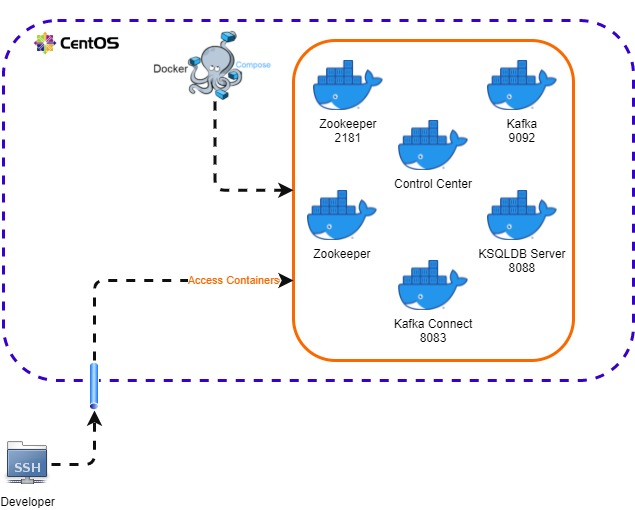


# Business Use Cases
|Sno|Details|
|---|----------|
|1| Customer should be able to place an order through the REST API|
|2| Customer shoul be able to get a status of the order from the System using REST API|
|3| System should be able to detect the frequency of credit card details in the order to detect a potential fraud|
|4| Customer should be able get an email notification once the order is processed successfully|


# Solution


# Logical Diagram
Below diagram allows an understanding how the Kafka, MuleSoft API's and KSQLDB working together to achive the desired solution as POC.

There are mainly 3 sections 
## 1. Kafka
It is running as docker container sevice managed by docker-compose, it has 5 topics created initially using kafka-topics binary to accept the orders and start processing. However, KSQLDB scripts does create a few topics underneath to process and generate the reports/records.
## 2. KSQLDB
KSQLDB Server is running as a Docker container managed by docker-compose, however it also runs the application generated by the script for data processing as queries. These app does the defined jobs as a query running alongside the KSQLDB server itself.

## 3. MuleSoft
Mule API's push the orders, customers details, payment details to Kafka topics and other side pull the data through streaming and transform the data, and either push the data back to Kafka topics or send notification to the external systems.

> Note: MuleSoft register all the Kafka consumers in a different Kafka consumer group to receive the same message across all the API's. However, using the same producer to push the messages into different topics.

> KSQLDB and MuleSoft APIs works independently, its Kafka which understand both of them, however we can choose a different platform or tools compatible with Kafka for the same task.

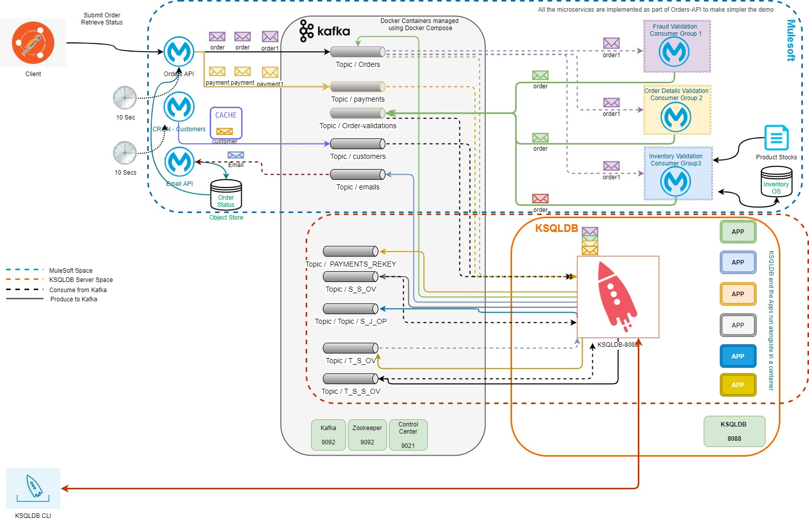


## MuleSoft Microservices 

We have chosen MuleSoft to provide a REST interface to expose the Orders API to the frontend system. MuleSoft APIs are also responsible for data transformation and order validation from/to Kafka topics.

|No.| API| Description | Kafka Topic (Read)|Kafka Topic (Write)|
|--|-------|-----------|-----|--------|
|1|Orders API| Orders API exposes a REST interface to the frontend to submit an order, Also has a CRON job optionally to submit the orders automatically (Stopped by default)| |```orders``` and ```payments```
|2|Order Details Validation| This API does a validation around a number of fields has a valid piece of data for example: quantity, price |```order-validations```|```order-validations```|
|3|Inventory Validation| This API does make sure that the ordered item is available in the stock and also update the stock based on the number of orders already placed |```order-validations```| ```order-validations```|
|4|Fraud Validation|This API does fraud validation based on the number of times a card being used by a customer(This is POC so this API does pass the validation at the moment)|```order-validations```|```order-validations```|
|5|Customer API| This API pull the customer details from a file and push them to Kafka topic| |``` customers```
|6| Email API| This API does send the email to the customers with the current status of the order| ```emails```


## Kafka Topics
|No.| Kafka Topic| Details 
|--|-------| -----------|
|1|```orders```| This topic keeps all the records with the status "Created" and "Validated"
|2|```order-validations```| This topic keeps all the records with validation status PASS or FAIL|
|3| ``` customers```| This topic keeps the records of all the available customers on the ecommerce system|
|4|```payments```| Record all the payment details|
|5|```emails```| Keep records of all emails to send to the customer once the order is processed|

## KSQLDB
KSQLDB is used for data transformation and report generation for all the orders. 
- Aggregate all the records from ```order-validations``` with the same orderid and Push a record in ```orders``` topic with orderstatus (VALIDATED)
- Run different joins on various table or streams to generate a relation between orders and payments (to verify payment was made successfully), orders and customers (to generate report for an email)
- Generate a report based on the joins and create new records in the ```emails``` topic

> Note: KSQLDB creates a range of topics while creating new stream or insert queries.

# How to Run the project?

1. Run the docker-compose services
2. Execute the Kafka topic script on the Kafka cluster
3. Run KSQL script on KSQLDB-CLI service
4. Run Orders API in Anypoint Studio
5. Submit the order and Verify the status using postman
6. Verify the entire system using logs


## 1. Run the docker-compose services
```sh
# SSH to the VM (its up to you how you get access to the docker-compose)
# I'm using ssh config file to expose all the ports to the local system, please check the file **config** under resource directory
ssh confluent
#developer@127.0.0.1's password: <TODO>   
# Copy resources/docker-compose.yml file to the location TODO PATH_TO_DOCKER_COMPOSE_FILE
cd <TODO PATH_TO_DOCKER_COMPOSE_FILE>/
# PLEASE MAKE SURE YOU HAVE BOTH FILES ON THIS DIRECTORY
# TODO 1: copy .env file here
# TODO 2: copy docker-compose.yml file here

# Run all the services
docker-compose up -d 
# Tail logs if you want
docker-compose logs --tail 20 

# Verify all the services are up and running
docker-compose ps
# Once all the service are up and running, get kafka cluster terminal 
docker exec -it kafka bash

```

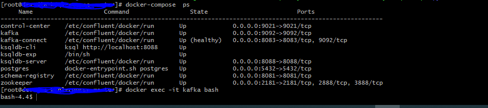


# 2. Execute the Kafka topic script on the Kafka cluster
Basically we will create all the topics which are required by the Mule APIs

```sh
kafka-topics --create  --partitions 1 --replication-factor 1 --zookeeper zookeeper:2181 --topic orders  && \
kafka-topics --create  --partitions 1 --replication-factor 1 --zookeeper zookeeper:2181 --topic order-validations  && \
kafka-topics --create  --partitions 1 --replication-factor 1 --zookeeper zookeeper:2181 --topic customers && \
kafka-topics --create  --partitions 1 --replication-factor 1 --zookeeper zookeeper:2181 --topic payments && \
kafka-topics --create  --partitions 1 --replication-factor 1 --zookeeper zookeeper:2181 --topic emails

# all good so far, you may exit from the shell
exit
```
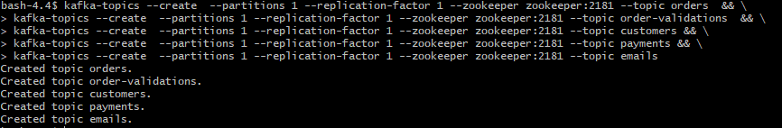

## Tips: Kafkacat is a great tool to troubleshoot the issue in Kafka topics, it basically allows you to print Kafka Topic Content

```sh
# Run kafkacat container
docker run --network ksql-course-master_default --tty --interactive --rm           confluentinc/cp-kafkacat           kafkacat -b kafka:29092           -C -t orders           -o beginning


```
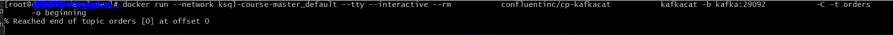


# 3. Run KSQL script on KSQLDB-CLI service
We have Kafka cluster up and running in the local environment as docker containers, also have created all the required Kafka topics
Its time to run KSQL script - 

## Get KSQLDB-CLI shell access 
Get the CLI from ```ksqldb-cli ``` container service, for more details about KSQLDB-CLI please find details [here](https://docs.ksqldb.io/en/latest/operate-and-deploy/how-it-works/)

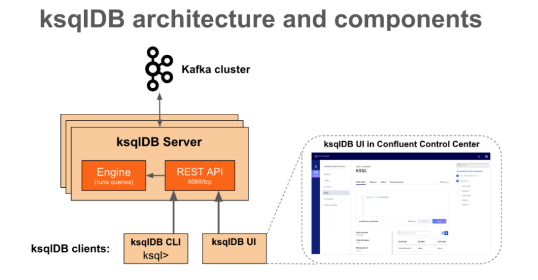

```sh
# Login to KSWLDB CLI
docker exec -it ksqldb-cli bash
# Connect to ksqldb server with ksql cli
ksql http://ksqldb-server:8088
```

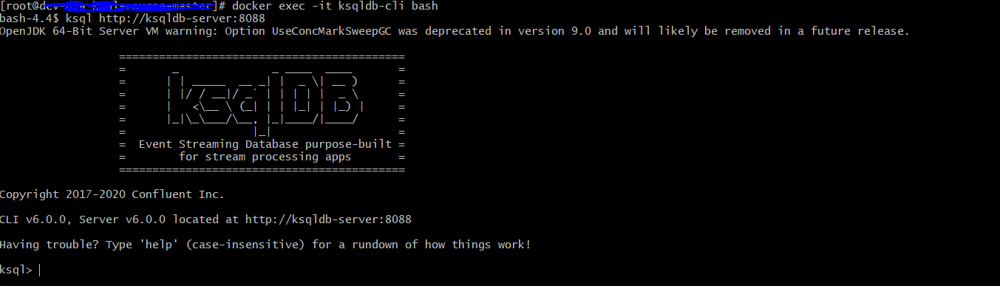

```sql
-- ----------------------------- Idea starts here ----------------------------------------------
-- 1. Create a stream from order-validations, called s_ov
-- 2. Create a table (t_s_s_ov) to make a materialized view through Group by orderid --> aggregate with tumbling window of 1 min where validation result is PASS (group by become a part of primary key) 	
-- 3. Step 2 will create an internal topic so we will create a stream out of it based on change event  s_t_s_s_ov
-- 4. Create stream from orders topic and another stream with orderid field as key and value s_o_key
-- 5-- Join two streams requires within timeframe
-- -- a. Filter orders which has status CREATED
-- -- b. Filter order-aggregation with total count = 3
-- -- c. join both using orderid
-- -- d. insert into a new stream from orders topic with order as a key and id. 
-- 6. Push results into orders topic with orderstatus VALIDATED
-- 6. Join with Order stream & set order to validated
-- 7. Push to orders 
-- 8. Create a stream from payments topic and another to push desired details with name payments_rekey (it just to create a report in next step)
-- 9. Create stream from customers table 
-- 10. Join orders with customer to create a new stream with desired details
-- 11. Create stream from emails topic and join with the stream created from above step
-- 12. Lastly, Generate a repost to send email and push to emails topic
-- ----------------------------- Idea ends here ----------------------------------------------

-- It will allow to read all the messages from the beginning of the topic
SET 'auto.offset.reset'='earliest';


-- Create steam from order-validations queue, since its nested json object to using STRUCT
DROP STREAM IF EXISTS s_ov;
CREATE STREAM s_ov  (OrderValidation STRUCT <OrderValidationResult VARCHAR, OrderValidationType VARCHAR,orderId integer> )  WITH (KAFKA_TOPIC='order-validations', VALUE_FORMAT='JSON');  
 

--$$$$$-------Don't use below statement ------------------
-- Below is working
> DROP table IF EXISTS t_s_ov delete topic;
> CREATE TABLE t_s_ov  AS select cast(ORDERVALIDATION->orderid as varchar) as rowkey ,  count(*) as total  from s_ov  window tumbling (size 60 seconds)   where ORDERVALIDATION->ORDERVALIDATIONRESULT ='PASS'   group by cast(ORDERVALIDATION->orderid as varchar) emit changes;
--$$$$$-------Don't use above statement ------------------


-- This is workaround for me to work with above statement
-- 2.a Stream all the orders which has Status PASS
DROP STREAM IF EXISTS s_s_ov;
create stream s_s_ov as select ORDERVALIDATION->orderid as id from s_ov where  ORDERVALIDATION->ORDERVALIDATIONRESULT ='PASS'  emit changes;
-- 2.b
-- Create a table with tumbling window
DROP table IF EXISTS t_s_s_ov;
CREATE TABLE t_s_s_ov  AS select id as rowkey, as_value(id) as id,  count(*) as total  from s_s_ov  window tumbling (size 60 seconds)   group by id emit changes;
select * from t_s_s_ov emit changes limit 2;

-- Need to remove windowing so creating a stream
DROP STREAM IF EXISTS s_t_s_s_ov;
CREATE STREAM s_t_s_s_ov  ( id integer, total integer )  WITH (KAFKA_TOPIC='T_S_S_OV',VALUE_FORMAT='JSON') ;
select * from s_t_s_s_ov emit changes limit 2;

-- Create Stream of Orders topic as s_o without key
DROP STREAM IF EXISTS s_o;
CREATE stream s_o ( id integer, quantity integer,price integer,customerId integer,OrderState varchar, product varchar )  WITH (KAFKA_TOPIC='orders', VALUE_FORMAT='JSON');
select * from s_o emit changes  limit 10;

-- Create stream to orders topic to push the update with order status -> VALIDATED
DROP STREAM IF EXISTS s_o_key;
CREATE stream s_o_key (id_key integer key,id integer, quantity integer,price integer,customerId integer,OrderState varchar, product varchar )  WITH (KAFKA_TOPIC='orders', VALUE_FORMAT='JSON');
-- Create Stream of Order-validations topic  s_ot
select * from s_o_key emit changes  limit 10;

  
-- Join two streams requires within timeframe
-- 1. Filter orders which has status CREATED
-- 2. Filter order-aggregation with total count = 3
-- 3. join both using orderid
-- 4. insert into a new stream from orders topic with order as a key and id. 
insert into s_o_key select o.id as id_key, as_value(o.id) as id, o.quantity as quantity,o.price as price,o.customerId as customerId, 'VALIDATED' as OrderState,o.product as product  from s_o o  left join  s_t_s_s_ov ot  within 1 HOURS  on o.id = ot.id where ot.total>=3 and o.OrderState = 'CREATED'   emit changes;

-- Learning 
-- > insert into s_t select o.id as id, o.quantity as quantity,o.price as price,o.customerId as customerId, 'VALIDATED' as ORDERSTATE,o.product as product  from s_o o  left join  s_t_s_s_ov ot  within 1 HOURS  on o.id = ot.id where ot.total>=3 and o.ORDERSTATE = 'CREATED'   emit changes ;
--Exception while preparing statement: INSERT INTO can only be used to insert into a stream. S_T is a table.


-- Create stream from payments
DROP STREAM IF EXISTS s_p;
CREATE stream s_p (id integer, amount integer,ccy varchar,orderId integer  )  WITH (KAFKA_TOPIC='payments', VALUE_FORMAT='JSON');
select * from s_p emit changes limit 2;

-- Rekey payments to join both orders and the payment together
DROP STREAM IF EXISTS s_p_rekey ;
CREATE STREAM s_p_rekey (orderId INT key, ccy varchar,amount double)
    WITH (kafka_topic='payments_rekey',
          partitions=1,
          value_format='json'); 
-- Insert selected items to the new topic
insert into s_p_rekey   SELECT orderId,ccy,cast(amount as double) as amount
    FROM s_p
    PARTITION BY orderId;
select * from s_p_rekey emit changes limit 1;

-- primary key must be a varchar
DROP table IF EXISTS t_c;
create table t_c ( id varchar primary key , firstName varchar, lastName varchar, email varchar, address varchar, level varchar )  WITH (KAFKA_TOPIC='customers', VALUE_FORMAT='JSON' );
select * from t_c emit changes limit 1;

 
-- create a join of order and the payment

DROP STREAM IF EXISTS s_j_op;
CREATE stream s_j_op as select o.id as id, o.quantity as quantity, o.price as amount, o.customerId as customerId, o.product as product, p.ccy as ccy  from s_o_key o join s_p_rekey p within 1 HOURS on o.id=p.orderId  emit changes;
select  *  from s_j_op emit changes limit 1; 


-- Create a topic to generate an email message for microservice 
DROP STREAM IF EXISTS s_e;
create stream s_e (orderId varchar key, email varchar, message varchar)  WITH (KAFKA_TOPIC='emails', VALUE_FORMAT='JSON' , PARTITIONS=1);
-- Join order_payment with customer 
 -- cast orderId to varchar
insert into s_e  select  cast(jop.id as varchar) as orderId, c.email as email, (
'Hi ' + c.FIRSTNAME + ', Thanks for the order for the item ' + jop.product + ' with quantity '+ cast(jop.quantity as varchar) + '. The payment of the amount '+ jop.ccy + ' '+ cast(jop.amount as varchar) +' has received successfully. We will ship your order at ' + c.ADDRESS + ' within next 20 working days!') as message from s_j_op jop join t_c c  on cast(jop.customerId as varchar)=c.id   PARTITION BY cast(jop.id as varchar)  emit changes;
select * from s_e emit changes limit 1;

```
> Please ignore existing messages from the topics, you might have found in the select queries.

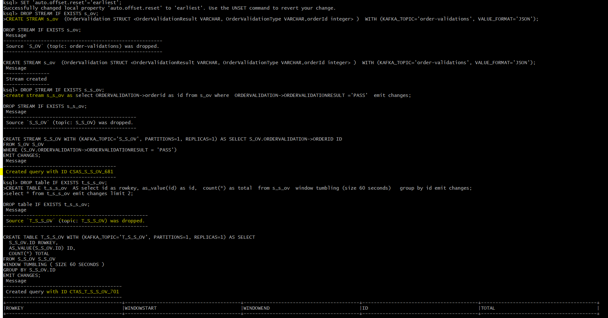

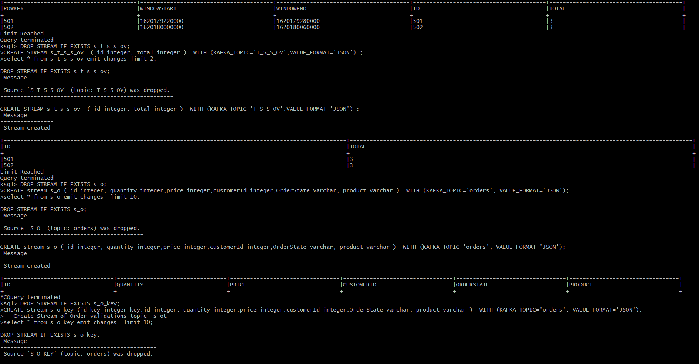

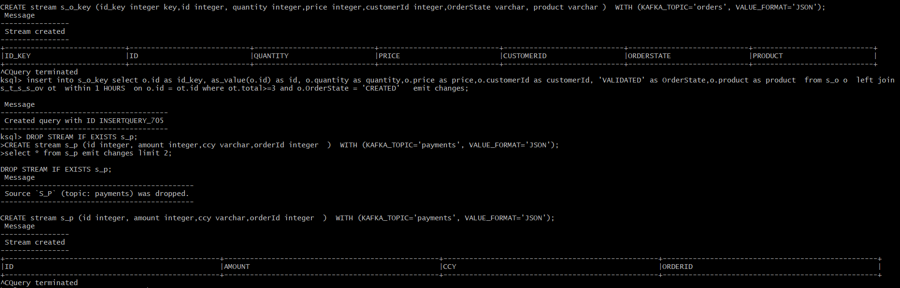

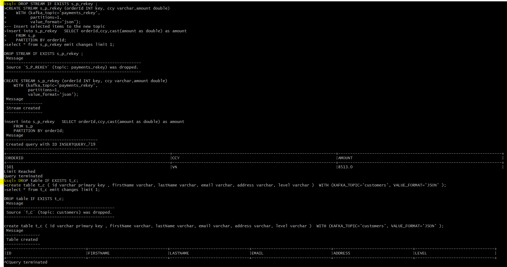

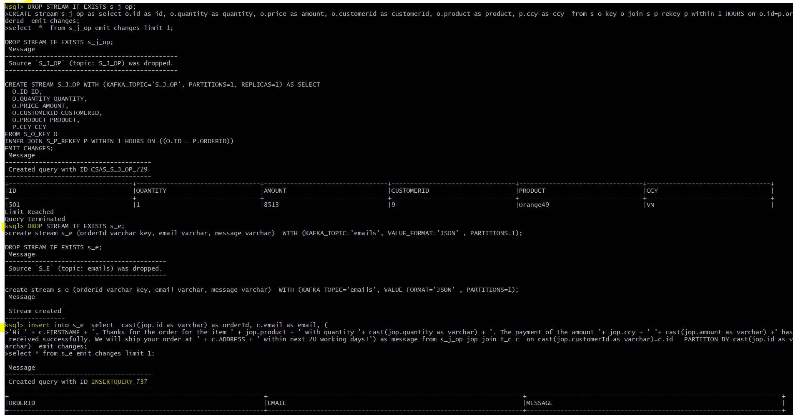


4. Run Orders API in Anypoint Studio
So far, We have created all the topics, KSQLDB-CLI scripts, now its time to run the Orders API and to do some testing.
> Note: You might want to ask, Why only one API, we were talking a lot more microservices in the logical diagram, Answer is, This is MVP so I don’t want to run 6 different project and tail them. Please feel free to split the project if you want.

- Import the API in Anypiont Studio and run it.
Its good time to expolore the Mule API itself.

    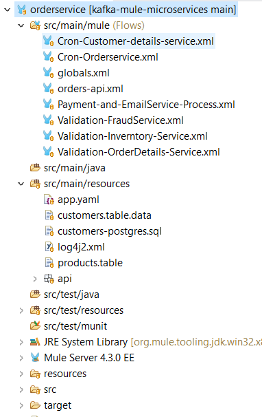

    |Sno|File Name|Implementation details|
    |-|-------|------------------------------|
    |1|Cron-Customer-details-service.xml| This is a cron job which read the file ```customers.table.data``` from resources and based on caching publish the a message in the Kafka topic ```customers```
    |2|Cron-Orderservice.xml| This job is stopped by default, however allows auto generation of an order and submit to the Kafka topic ```orders``` and the payment information into the topic ```payments```
    |3| orders-api.xml| REST interface to submit an order or get the status|
    |4|Validation-FraudService.xml| Read the messages from Kafka topic ```orders``` , perform validation (not implemented much in this POC) and submit the status result in Kafka topic ```order-validations```
    |5|Validation-Inverntory-Service.xml| Initially read product stock lists from the file ```products.table``` and keep track in object Store. As part of validation it reads the messages from Kafka topic ```orders``` , perform validation , update inventory and submit the status result in Kafka topic ```order-validations```
    |6|Validation-OrderDetails-Service.xml| Read the messages from Kafka topic ```orders``` , perform order details validation and submit the status result in Kafka topic ```order-validations```
    |7|Payment-and-EmailService-Process.xml| 1.  Read the messages from Kafka topic ```emails``` , and store them into object store to retrieve the order status.
    | |Payment-and-EmailService-Process.xml| 2. Read messages from ```payments```, store in the object store (At the moment its only for debuging purpose)

    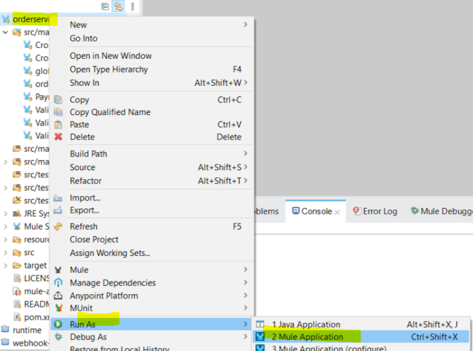
    
    > Great news, we have our Mule API up and running
    
    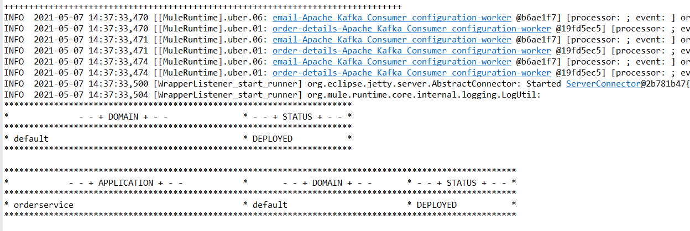
    
    > Customer Details are submitted to the ```customers``` topic successfully.
    
    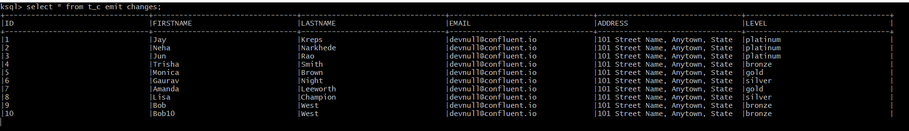

# 5. Submit the order and Verify the status using postman
Its time to do some magic, lets do it -

## Import the postman collection from ```resources/Dhaks Order API.postman_collection.json```
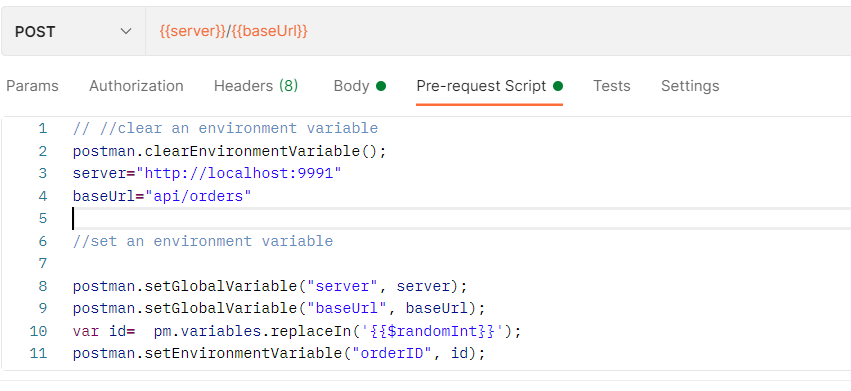
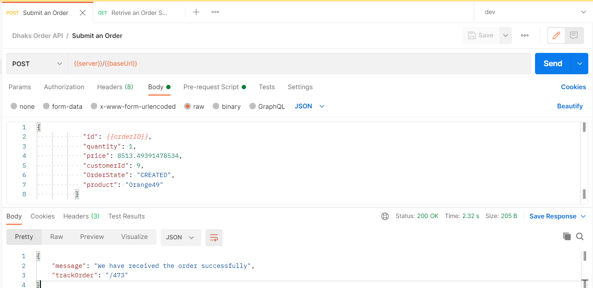
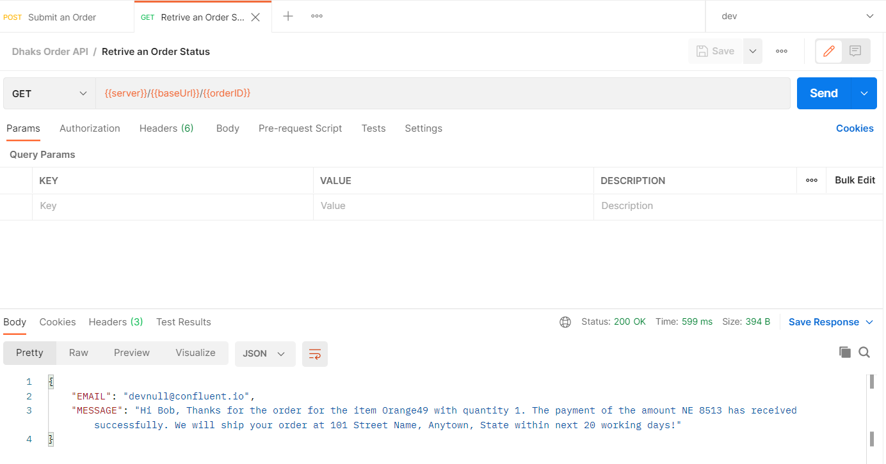

### Submit an Order
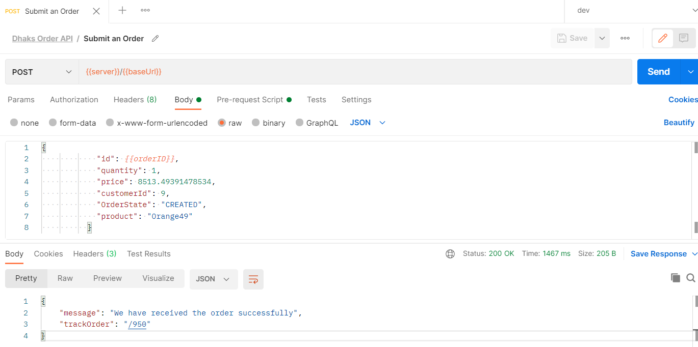


# 6. Verify the entire system using logs

# 1. Check Order API logs
    Track the order in the system is realy very important, So I have created logs for it to help you understand.
    - You might want to have a look on the submit order, 3 entries of ORDER Validation status and the email message.
 
    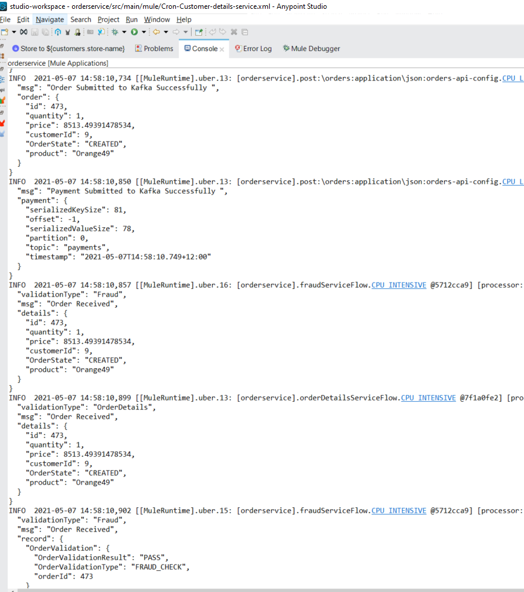

    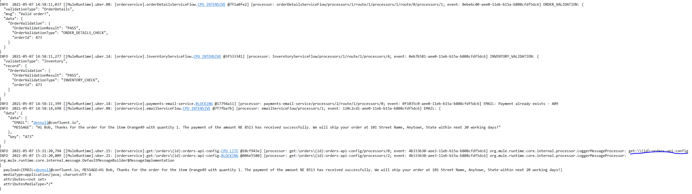

# 2. Check KSQLDB 
    Once again, Its very important how to check the details in the KSQLDB as well. Please find the comments before all the scripts to understand.

```sql
    -- 1. We are expecting 2 records Created and Validated respectively.
    select * from s_o where ID=473 emit changes limit 1;
    -- 2. Check the payments, Should be a payment on this order
    select * from s_p where ORDERID=473 emit changes limit 1;
    -- 3. Check the order-validations, should have 3 records with status PASS
    select * from s_ov where  ORDERVALIDATION->ORDERID=473  emit changes limit 3;
    -- 4. Some other streams and tables
    select * from s_t_s_s_ov  where id=473 emit changes limit 1;
    select * from t_s_s_ov where id=473 emit changes limit 1;
    -- 5. Check the orders topic which accept only VALIDATED orders
    select * from s_o_key where id=473 emit changes limit 1;
    -- 6. Check customer details, should have customer details
    select * from t_c emit changes limit 10;
    -- 7. Check emails, should have an email generated for the customer
    select * from s_e emit changes limit 1;

```
    


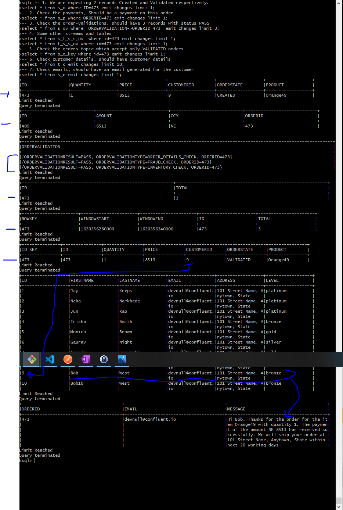


 
# KSQL DB commands to check the system
Here are a few command you can utilize for further details and troubleshoot the issues.

## List topics and streams
Find all the topics and stream in Kafka.

```sql
list topics;
list streams;
```  
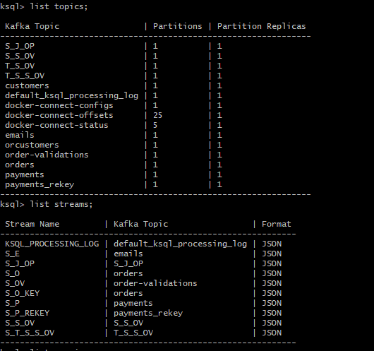

    
    
```sql
list queries;
```

  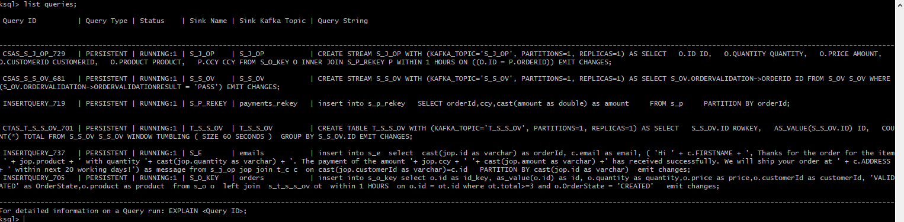


```sql
print emails;
```
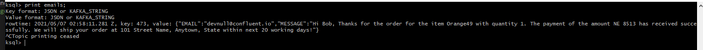


# Cleanup
First terminate all the queries, and then drop the tables and streams.
```sql
-- docker exec -it ksqldb-cli bash  
---------------------------------
-- cleanup 
terminate <TODO_QUERYNAME1>;
DROP STREAM IF EXISTS s_t_s_s_ov;

terminate <TODO_QUERYNAME2>;
DROP STREAM IF EXISTS t_s_s_ov;

terminate <TODO_QUERYNAME3>;
DROP STREAM IF EXISTS s_s_ov;

-- Delete topics as well
DROP STREAM IF EXISTS s_o delete topic;
DROP STREAM IF EXISTS s_ov delete topic;

```
## Delete topics

```sh
docker exec -it kafka bash && \
kafka-topics --zookeeper localhost:2181 --delete --topic orders  && \
kafka-topics --zookeeper localhost:2181 --delete --topic payments && \
kafka-topics --zookeeper localhost:2181 --delete --topic customers && \
kafka-topics --zookeeper localhost:2181 --delete --topic payments && \
kafka-topics --zookeeper localhost:2181 --delete --topic emails && \
kafka-topics --zookeeper localhost:2181 --delete --topic && \
kafka-topics --zookeeper localhost:2181 --delete --topic order-validations 
```


# Thanks
If you have you are here, which means you have gone through the entire project documents, so thank you very much for your time, feel free to send any feedback at [LinkedIn] (https://www.linkedin.com/in/sureshdhaka/).

# Further Readings

## Joins and Windows
ksqlDB enables grouping records that have the same key for stateful operations, like joins, into windows. You specify a retention period for the window, and this retention period controls how long ksqlDB waits for out-of-order records. If a record arrives after the window's retention period has passed, the record is discarded and isn't processed in that window.
> Note: Only stream-stream joins are windowed.
### Join Requirements
- Co-partitioned data
- Join Capabilities
> RIGHT OUTER JOIN isn't supported. Instead, swap the operands and use LEFT JOIN.
> ksqlDB only supports INNER and LEFT joins between a stream and a table.

# Declaration
This article is only for leanring purpose, feel free to fork the repo.

# References
- [KSQLDB](https://docs.ksqldb.io/)
- [Kafka](https://kafka.apache.org/)
- [MuleSoft](https://docs.mulesoft.com/general/)
